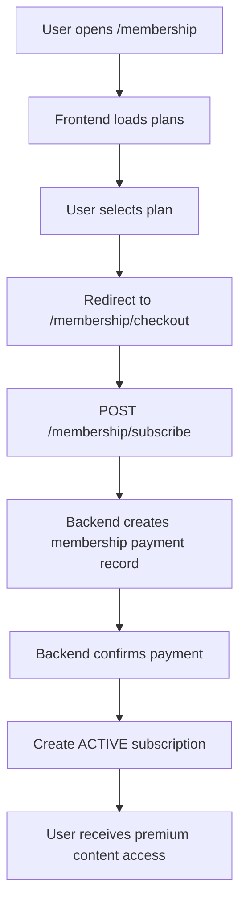
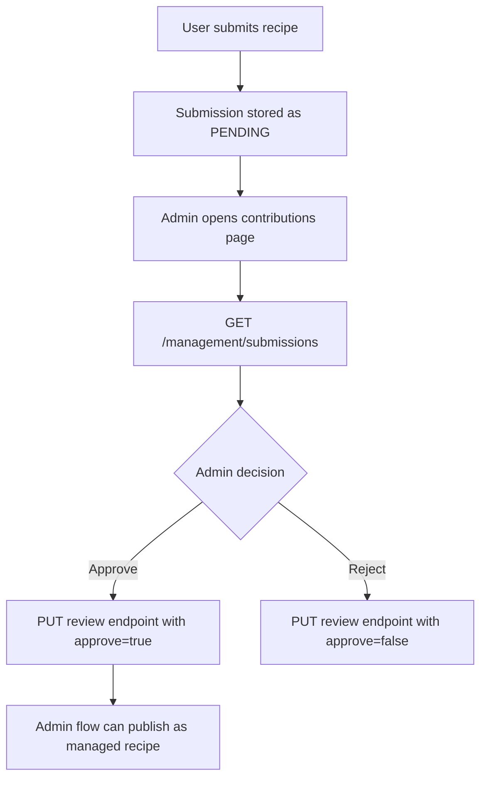
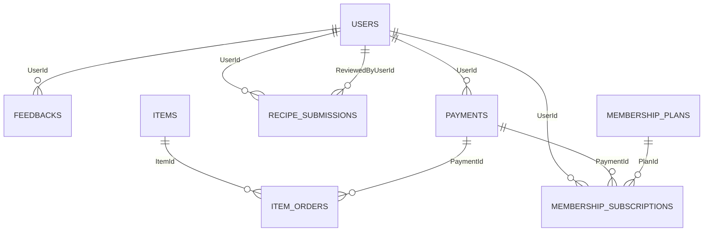

# Team Thesis Documentation (TLNV) - IScream Project

## Table of Contents

- [1. Problem Definition](#1-problem-definition)
  - [1.1 Introduction](#11-introduction)
  - [1.2 Implementation Environment](#12-implementation-environment)
  - [1.3 User Stories](#13-user-stories)
- [2. Use Cases](#2-use-cases)
  - [2.1 Browse Recipes](#21-browse-recipes)
  - [2.2 Purchase Products](#22-purchase-products)
  - [2.3 Subscribe to Membership](#23-subscribe-to-membership)
  - [2.4 Submit Recipe Contributions](#24-submit-recipe-contributions)
  - [2.5 Submit Feedback](#25-submit-feedback)
  - [2.6 Admin Management Operations](#26-admin-management-operations)
- [3. Flow Charts](#3-flow-charts)
  - [3.1 Browse Recipes Flow](#31-browse-recipes-flow)
  - [3.2 Purchase Products Flow](#32-purchase-products-flow)
  - [3.3 Membership Subscription Flow](#33-membership-subscription-flow)
  - [3.4 Submission Review Flow (Admin)](#34-submission-review-flow-admin)
- [4. Database (Based Strictly on Provided Azure SQL)](#4-database-based-strictly-on-provided-azure-sql)
  - [4.1 Relationship Diagram](#41-relationship-diagram)
  - [4.2 Core Table Specifications](#42-core-table-specifications)
- [5. UI/UX](#5-uiux)
  - [5.1 Public and Member Interfaces](#51-public-and-member-interfaces)
  - [5.2 Administrative Interfaces](#52-administrative-interfaces)
- [6. Summary](#6-summary)

## 1. Problem Definition

### 1.1 Introduction

IScream is a full-stack platform that combines recipe sharing, membership-based premium content, and product commerce in a single system. The project supports three major business directions in one product journey:

- Content experience: users can explore ice cream recipes and unlock deeper recipe details through active membership.
- Commerce experience: users can browse products, place orders, and complete a mock payment flow.
- Community and moderation: users can submit recipes and feedback, while administrators review and manage operational data.

This document is intentionally constrained to verified information that already exists in the project:

- Source documentation: `README.md`, `BACKEND_SUMMARY.md`, `IMPLEMENTATION_CHECKLIST.md`
- Backend and frontend implementation currently present in the repository
- Azure SQL DDL shared in the request

No assumptions or external requirements have been added beyond the available materials above.

### 1.2 Implementation Environment

The current implementation environment, verified from the repository, is:

- Frontend stack:
  - Next.js `16.1.6`
  - React `19.2.3`
  - TypeScript `^5`
  - Tailwind CSS `^4`
  - Source reference: `frontend/package.json`
- Backend stack:
  - Azure Functions v4 (HTTP-triggered, isolated worker)
  - .NET `10`
  - C# services and repository layers
  - Source reference: `backend/Program.cs`
- Data layer:
  - SQL Server (Azure SQL or LocalDB)
  - Raw ADO.NET repository implementation (no ORM)
- Authentication and authorization:
  - JWT-based authentication
  - BCrypt password hashing
  - Role model used in code: `MEMBER`, `ADMIN`
- API discoverability:
  - OpenAPI/Swagger enabled in backend runtime
- Delivery and deployment notes:
  - Frontend target: Azure Static Web Apps
  - Backend target: Azure Functions
  - CI/CD references: GitHub Actions

### 1.3 User Stories

#### 1.3.1 User Type 1: Guest (Unauthenticated)

i. As a guest, I can browse public informational pages such as home, about, FAQ, contact, careers, and privacy policy.

ii. As a guest, I can register a new account through `/register`.

iii. As a guest, I can sign in through `/login`.

iv. As a guest, I can view the recipe listing page and see premium/locked indicators for content that requires membership.

v. As a guest, I can submit general feedback from `/feedback`.

vi. As a guest, I can submit a recipe contribution when at least a name or email is provided (validated in backend submission service).

#### 1.3.2 User Type 2: Member (Authenticated User)

i. As a member, I can view and update my profile data (full name and email) from `/profile`.

ii. As a member, I can review membership plans and proceed to membership checkout from `/membership` and `/membership/checkout`.

iii. As a member, I can access recipe details based on subscription access logic implemented by the backend.

iv. As a member, I can browse shop items and place orders through `/shop` and `/shop/checkout`.

v. As a member, I can view my order history from my profile page.

vi. As a member, I can submit recipe contributions through `/submit` (guarded by authentication in frontend).

vii. As a member, I can submit feedback as a registered user.

#### 1.3.3 User Type 3: Admin

i. As an admin, I can authenticate via `/admin/login` (server-side role validation through `POST /auth/admin/login`).

ii. As an admin, I can access an administrative dashboard and monitor operational summaries.

iii. As an admin, I can create, update, and delete recipes through management endpoints.

iv. As an admin, I can list orders, inspect specific orders, and update order statuses.

v. As an admin, I can list users and activate/deactivate user accounts.

vi. As an admin, I can review submitted community recipes (approve/reject decisions).

vii. As an admin, I can list feedback, inspect feedback detail, and mark feedback as read.

viii. As an admin, I can manage membership plans and list active members through dedicated management endpoints.

## 2. Use Cases

### 2.1 Browse Recipes

- Primary actors: Guest, Member
- Objective: Discover and read recipe content.
- Entry points: `GET /recipes`, `GET /recipes/{id}`
- Preconditions:
  - None for listing.
  - For full detail, membership and access checks are applied in backend service logic.
- Main outcome:
  - Public information is returned for list/detail.
  - `ingredients` and `procedure` are conditionally locked when access conditions are not satisfied.

### 2.2 Purchase Products

- Primary actor: Authenticated user
- Objective: Place an order and complete checkout payment flow.
- Entry points: `POST /checkout`, `POST /checkout/{id}/pay`
- Preconditions:
  - Selected item exists.
  - Requested quantity is valid and within stock.
- Main outcome:
  - Order and payment records are created.
  - On successful payment validation, payment status is set to success and order status transitions to processing.
- Alternative outcomes:
  - Stock or card validation failures return explicit error messages.

### 2.3 Subscribe to Membership

- Primary actor: Authenticated user
- Objective: Activate a membership plan to unlock premium recipe access.
- Entry points: `GET /membership/plans`, `POST /membership/subscribe`, `GET /membership/me`
- Preconditions:
  - Plan exists and is active.
  - User is authenticated.
- Main outcome:
  - Membership payment record is created and confirmed by backend flow.
  - An active subscription record is created.

### 2.4 Submit Recipe Contributions

- Primary actors: Member (frontend flow), Guest/Member (backend capability)
- Objective: Submit community recipe content for moderation.
- Entry point: `POST /submissions`
- Preconditions:
  - Title meets minimum validation.
  - Guest submissions include either name or email.
- Main outcome:
  - A submission is stored with status `PENDING`.

### 2.5 Submit Feedback

- Primary actors: Guest, Member
- Objective: Provide feedback to the IScream team.
- Entry point: `POST /feedback`
- Preconditions:
  - Message meets minimum length validation.
- Main outcome:
  - Feedback is persisted and available to admin management screens.

### 2.6 Admin Management Operations

- Primary actor: Admin
- Objective: Operate and moderate the platform.
- Management scopes:
  - Recipes: create/update/delete
  - Orders: list/detail/status update
  - Users: list/active status update
  - Submissions: list/review
  - Feedback: list/detail/mark as read
  - Membership: plan management and member listing
- Main outcome:
  - Administrative changes are persisted through `management/*` backend routes with role validation.

## 3. Flow Charts

### 3.1 Browse Recipes Flow

```mermaid
flowchart TD
A[User opens /recipes] --> B[Frontend requests GET /recipes]
B --> C[Backend returns paginated recipe list]
C --> D[User selects a recipe]
D --> E[Frontend requests GET /recipes/{id}]
E --> F{Has access to full details?}
F -->|Yes| G[Return full recipe including ingredients and procedure]
F -->|No| H[Return locked detail response for premium fields]
```

### 3.2 Purchase Products Flow

```mermaid
flowchart TD
A[User opens /shop] --> B[Selects item and clicks Buy Now]
B --> C[User enters checkout form]
C --> D[POST /checkout]
D --> E[Create order PENDING and payment PENDING]
E --> F[User enters card data]
F --> G[POST /checkout/{id}/pay]
G --> H{Card and request valid?}
H -->|Yes| I[Payment SUCCESS and order PROCESSING]
H -->|No| J[Return payment error to user]
```

### 3.3 Membership Subscription Flow



### 3.4 Submission Review Flow (Admin)



## 4. Database (Based Strictly on Provided Azure SQL)

### 4.1 Relationship Diagram



### 4.2 Core Table Specifications

#### 4.2.1 `USERS`

- Primary key: `Id` (`uniqueidentifier`)
- Main columns: `Username`, `Email`, `PasswordHash`, `FullName`, `Role`, `CreatedAt`, `IsActive`
- Key constraints and indexes:
  - Unique index on `Username`
  - Filtered unique index on `Email` when value is not null

#### 4.2.2 `ITEMS`

- Primary key: `Id`
- Main columns: `Title`, `Description`, `Price`, `Currency`, `ImageUrl`, `Stock`, `CreatedAt`, `UpdatedAt`
- Technical behavior:
  - Trigger `TR_ITEMS_SetUpdatedAt` updates `UpdatedAt` after record updates
  - Index on `Stock`

#### 4.2.3 `ITEM_ORDERS`

- Primary key: `Id`
- Foreign keys:
  - `ItemId -> ITEMS(Id)`
  - `PaymentId -> PAYMENTS(Id)`
- Main columns:
  - `OrderNo`, `CustomerName`, `Email`, `Phone`, `Address`
  - `Quantity`, `UnitPrice`, computed `TotalCost`
  - `Status`, `CreatedAt`, `UpdatedAt`
- Technical behavior:
  - Unique index on `OrderNo`
  - Indexes on `ItemId` and `PaymentId`
  - Trigger `TR_ITEM_ORDERS_SetUpdatedAt`

#### 4.2.4 `PAYMENTS`

- Primary key: `Id`
- Foreign key: `UserId -> USERS(Id)`
- Main columns: `Amount`, `Currency`, `Type`, `Status`, `CreatedAt`
- Indexing:
  - Composite index on `UserId`, `Status`, `CreatedAt`

#### 4.2.5 `MEMBERSHIP_PLANS`

- Primary key: `Id` (`identity`)
- Main columns: `Code`, `Price`, `Currency`, `DurationDays`, `IsActive`
- Constraints:
  - Unique index on `Code`

#### 4.2.6 `MEMBERSHIP_SUBSCRIPTIONS`

- Primary key: `Id`
- Foreign keys:
  - `UserId -> USERS(Id)`
  - `PlanId -> MEMBERSHIP_PLANS(Id)`
  - `PaymentId -> PAYMENTS(Id)`
- Main columns: `StartDate`, `EndDate`, `Status`, `CreatedAt`
- Indexing:
  - By `UserId`, `Status`, `EndDate`
  - By `PlanId`
  - By `PaymentId`

#### 4.2.7 `RECIPES`

- Primary key: `Id`
- Main columns: `FlavorName`, `ShortDescription`, `Ingredients`, `Procedure`, `ImageUrl`, `IsActive`, `CreatedAt`, `UpdatedAt`
- Technical behavior:
  - Trigger `TR_RECIPES_SetUpdatedAt`
  - Index on `IsActive`, `CreatedAt`

#### 4.2.8 `RECIPE_SUBMISSIONS`

- Primary key: `Id`
- Foreign keys:
  - `UserId -> USERS(Id)`
  - `ReviewedByUserId -> USERS(Id)`
- Main columns:
  - `Title`, `Description`, `Ingredients`, `Steps`, `ImageUrl`
  - `Status`, `PrizeMoney`, `CertificateUrl`
  - `CreatedAt`, `ReviewedAt`
- Indexing:
  - By `Status`
  - By `UserId`
  - By `ReviewedByUserId`

#### 4.2.9 `FEEDBACKS`

- Primary key: `Id`
- Foreign key: `UserId -> USERS(Id)`
- Main columns: `Name`, `Email`, `Message`, `IsRegisteredUser`, `CreatedAt`
- Indexing:
  - Composite index on `UserId`, `CreatedAt`

## 5. UI/UX

The implementation in `frontend/src/app` shows both customer-facing and admin-facing interfaces.

### 5.1 Public and Member Interfaces

#### 5.1.1 Home (`/`)

- Landing content and hero sections.

#### 5.1.2 Login (`/login`)

- Customer authentication form with client-side validation and service integration.

#### 5.1.3 Register (`/register`)

- User registration form and automatic sign-in behavior after successful registration.

#### 5.1.4 Recipes List (`/recipes`)

- Paginated recipe listing.
- Mixed display pattern for free access and locked membership cards.

#### 5.1.5 Recipe Detail (`/recipes/[id]`)

- Full recipe presentation with conditional content based on backend access rules.

#### 5.1.6 Shop (`/shop`)

- Product catalog view for purchasable items/books.

#### 5.1.7 Shop Checkout (`/shop/checkout`)

- Multi-step checkout: order creation, payment entry, completion state.

#### 5.1.8 Membership Plans (`/membership`)

- Plan selection interface and membership call-to-action.

#### 5.1.9 Membership Checkout (`/membership/checkout`)

- Membership payment flow and activation confirmation UI.

#### 5.1.10 Profile (`/profile`)

- Profile update form, membership status card, and order history table.

#### 5.1.11 Submit Recipe (`/submit`)

- Authenticated submission form with structured recipe fields and success state.

#### 5.1.12 Feedback (`/feedback`)

- Feedback submission form with success/error handling.

#### 5.1.13 Informational Pages

- About (`/about`)
- FAQ (`/faq`, `/about/faq`)
- Contact (`/contact`)
- Careers (`/careers`)
- Privacy Policy (`/privacy-Policy`)

### 5.2 Administrative Interfaces

#### 5.2.1 Admin Login (`/admin/login`)

- Dedicated admin authentication screen.

#### 5.2.2 Admin Dashboard (`/admin/dashboard`)

- Summary cards and quick access to operations.

#### 5.2.3 Admin Recipes (`/admin/recipes`)

- Recipe management interface.

#### 5.2.4 Admin Orders (`/admin/orders`)

- Order management and status updates.

#### 5.2.5 Admin Users (`/admin/users`)

- User listing and activation controls.

#### 5.2.6 Admin Contributions (`/admin/contributions`)

- Recipe submission review workflow (approve/reject, with publish flow in admin UI logic).

#### 5.2.7 Admin Feedback (`/admin/feedback`)

- Feedback monitoring and read-state handling.

## 6. Summary

The IScream project currently delivers a coherent full-stack architecture with clear domain separation across authentication, recipes, commerce, membership, submissions, and feedback.

From the verified implementation, key strengths are:

- Layered backend organization (Functions -> Services -> Repository)
- Role-aware API behavior for member/admin boundaries
- SQL schema with strong relational constraints, indexing, and update triggers
- Frontend coverage for both customer journeys and admin operations

The delivered feature set, based solely on existing code and provided SQL, is sufficient to support the intended business model:

- User account lifecycle and role-based access
- Membership-gated premium content
- Product ordering and checkout payment simulation
- Community contribution and moderation workflow
- Feedback intake and administrative response handling

This document intentionally avoids adding non-implemented or speculative requirements and reflects only confirmed project artifacts.
